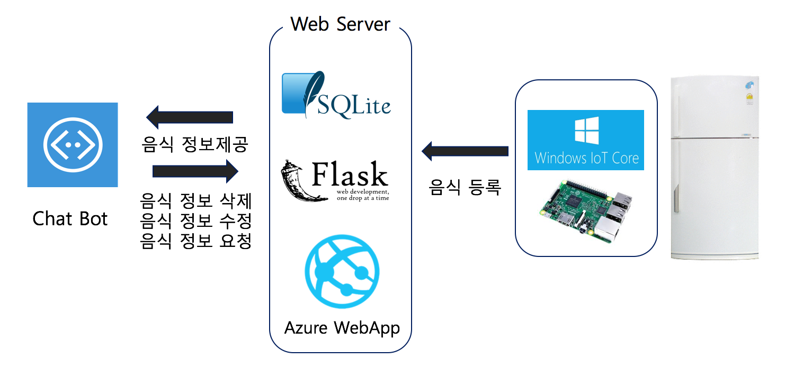
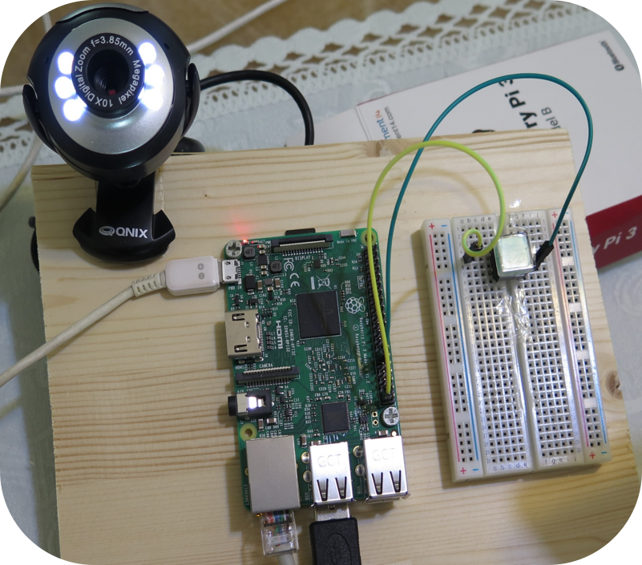

Chatkit(Chat + Check Kitchen)
---
Chatbot을 이용한 주방 관리 시스템의 냉장고 서버와 냉장고 카메라 제어 소스(Windows IOT)  
전체가 아닌 담당한 부분 입니다.

- ChatKitRefrigerator : 냉장고 카메라 제어 소스(MainPage.xaml.cs)
- ChatKitWebserver : 냉장고 서버 소스(views.py)

## 시스템 구성

## 하드웨어
버튼(인터럽트)으로 사진 촬영 후 웹 서버로 전송

## My Team
[Yun](https://gitlab.com/racersyun) : ChatBot, Gas range  
KJW : Gas range

## 기타 사항 
Azure의 WebApp인스턴스를 이용해 배포      
Microsoft IOT 공모전 Windows IOT상 수상 [기사](http://m.zdnet.co.kr/news_view.asp?artice_id=20170413165249#imadnews)

